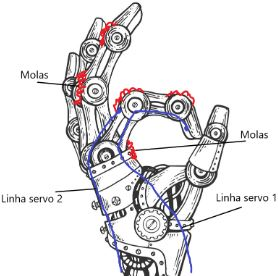

<!-- # [Mirror Hand](index.md) -->

### Construção da mão mecânica

 A construção da mão robótica será feita com impressora 3D, utilizando um modelo previsto para ser definido até a entrega 1 do projeto

 O sistema de movimento será feito através de servo motores, linhas e polias. Cada dedo será controlado por 2 servo motores, um para flexionar as articulações interfalângicas com uma linha presa na parte posterior da falange distal e molas nas faces anteriores das articulações interfalângicas responsáveis pela extensão. O segundo servo motor irá realizar a extensão da articulação metacarpofalângica com uma mola responsável por sua flexão.

## Alternativas caso o preço para impressão 3D seja muito caro e/ou complexo

  - Construir uma mão mais simplificada com impressora 3D
  - Simplificar a mão construindo as falanges com pedações maciços de algum material como madeira ou resina sem usar impressora 3D

## Imagens

 
<small>Figura 1 - Mão Robótica</small>

<small>Figura 2 - Mão Robô InMoov</small>
 

<small>Figura 3 - Exemplo de mão robô simplificada</small>
